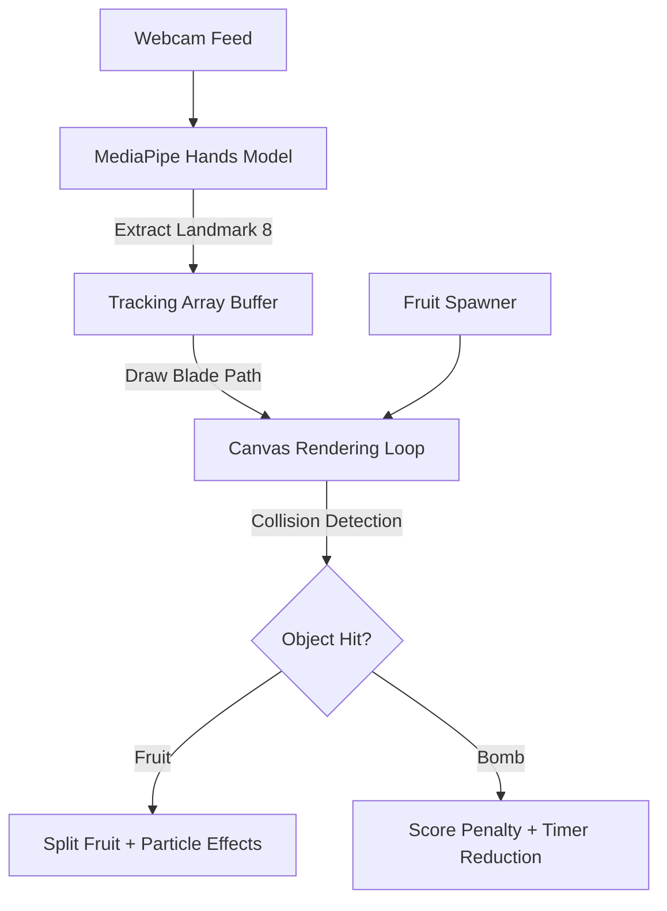

# 🥷 Fruit Slicer with hand tracking 

[](https://react.dev/)
[](https://google.github.io/mediapipe/)
[](https://developer.mozilla.org/en-US/docs/Web/API/Canvas_API)

A real-time hand-tracking fruit slicing game inspired by Fruit Ninja, built using React, MediaPipe Hands, and HTML5 Canvas.

Instead of using a mouse or keyboard, players control a virtual blade using their index finger through a webcam. The application tracks hand landmarks in real time, detects collisions between the blade path and flying objects, and generates slicing effects, combo bonuses, and score-based gameplay.

---

## 🚀 Live Demo

🌐 **Play Now:** https://fruit-cutting-game.netlify.app/

---


## ✨ Key Features

* ✋ Real-time hand tracking using MediaPipe Hands
* 🍉 Slice fruits using finger gestures
* 💥 Bomb detection with score and timer penalties
* ⚡ Combo scoring system
* 🔪 Double-cut mechanics for bonus points
* 🎨 Dynamic juice splash particle effects
* ⏱️ 60-second arcade gameplay
* 🌐 Fully playable in the browser

---

## 🛠️ Tech Stack

### Frontend

* React
* JavaScript
* Vite

### Computer Vision

* MediaPipe Hands
* WebRTC

### Graphics & Rendering

* HTML5 Canvas API

---

## 🏗️ System Architecture



---

## 👁️ Computer Vision Pipeline

### Hand Tracking

* Webcam frames are processed using MediaPipe Hands.
* Index finger tip coordinates (`Landmark[8]`) are extracted.
* Finger coordinates are mapped directly onto the game canvas.
* Tracking history is automatically cleared when the hand leaves the frame.

### Blade System

* Finger movement generates a glowing blade trail.
* The trail is continuously updated in real time.
* Collision checks are performed against active game objects.

---

## 🎨 Rendering & Physics Engine

### Dynamic Object Generation

* Multiple fruit types are generated with unique visual characteristics.
* Custom bomb assets are rendered separately from fruit objects.

### Physics Simulation

* Variable launch velocities
* Gravity-based motion
* Independent object rotation
* Continuous position updates

### Particle Effects

* Juice splash particles are spawned when fruits are sliced.
* Colors dynamically match the fruit type.
* Particles fade naturally over time.

---

## ⚔️ Gameplay Mechanics

### Combo System

Multiple fruits sliced in a single movement generate combo bonuses.

Example:

```text
+2 COMBO!
+3 COMBO!
```

### Double-Cut System

After slicing a fruit, the resulting halves remain active and can be sliced again for additional points.

Example:

```text
DOUBLE CUT!
```

### Bomb Penalties

When a bomb is hit:

* Score decreases by 5 points
* Timer decreases by 10 seconds
* Visual warning effect is triggered

Example:

```text
BOMB! -5 pts
```

---

## 🧩 Challenges Faced

* Mapping MediaPipe hand landmarks accurately to canvas coordinates
* Reducing tracking jitter for smoother gameplay
* Implementing collision detection for fast-moving objects
* Maintaining high FPS while rendering animations and particles
* Handling dynamic object splitting and secondary hitboxes

---

## 🚀 Future Improvements

* Multiple difficulty levels
* Global leaderboard
* Mobile support
* Gesture-based special attacks
* Multiplayer mode
* Additional fruit varieties
* Achievement and reward system

---

## ⚙️ Installation

### Clone Repository

```bash
git clone https://github.com/shravani492006/fruit-slicer-hand-tracking.git
cd fruit-slicer-hand-tracking
```

### Install Dependencies

```bash
npm install
```

### Run Development Server

```bash
npm run dev
```

---

## 🎮 Controls

### Hardware

* Webcam (built-in or external)

### Gameplay

* Extend your index finger into the camera view.
* Move your finger to control the blade.
* Slice fruits to earn points.
* Avoid bombs.
* Score as many points as possible within 60 seconds.

---

## 📈 Version History

### v2.0.0

* Optimized rendering using `useRef`
* Added combo system
* Added double-cut mechanics
* Added particle effects
* Added bomb penalties and visual alerts

### v1.0.0

* Initial hand-tracking implementation
* Basic fruit spawning and slicing mechanics

---

## 👩‍💻 Author

**Shravani Kadam**

Built to explore real-time computer vision, interactive gameplay systems, and browser-based hand tracking using modern web technologies.
